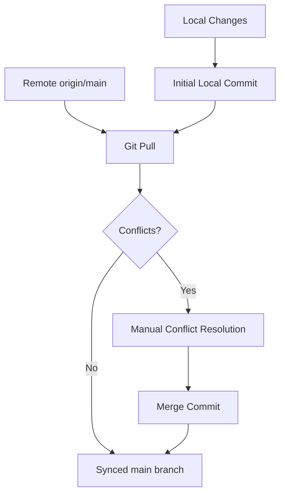

# Task Plan: Pull Remote Changes and Resolve Conflicts

## Objective
Pull the latest changes from the remote repository, resolve any merge conflicts logically, and commit local changes with a professional message.

## Current Repository State
- **Branch**: `main`
- **Status**: Behind `origin/main`.
- **Local Changes**: Multiple documentation files, `vite.config.ts`, `words.txt`, and `hospital_queue_system.sql` are currently staged or modified.
- **Documentation**: Extensive documentation exists in `docs/` but needs commitment.

## Step-by-Step Plan
1. [x] **Initial Commit**: Stage and commit all current local changes.
2. [x] **Fetch and Pull**: Execute `git pull origin main --rebase`.
3. [x] **Conflict Resolution**: (Completed).
4. [x] **Verification**: (Completed via `npm run build`).
5. [x] **Documentation Update**: (Completed).
6. [x] **Push to Feature Branch**: Created `feature/docs-and-refactor-sync` and pushed.
7. [ ] **Merge to Main**: Merge the feature branch into `main` and push to `origin`.
8. [ ] **Cleanup**: Delete the feature branch locally and remotely.

## Assumptions & Risks
- **Assumptions**: The remote changes are compatible with the core stack.
- **Risks**: Complex conflicts in `vite.config.ts` or core application logic could break the build.
- **Mitigation**: Perform build checks after resolution.

## Success Criteria
- Remote changes are merged successfully.
- Local changes are preserved or integrated logically.
- Repository is in a clean state and synchronized with `origin main`.
- Detailed documentation of the resolution process.

## Dependency Graphs

## Stakeholder Considerations
- **Peter Thairu Muigai**: Project integrity and documentation quality.
- **Collaborators**: Visibility into changes via clear commit messages.

## Cost Analysis
- Local git operations: Negligible.
- Potential build/CI costs: Minimal if run locally.
