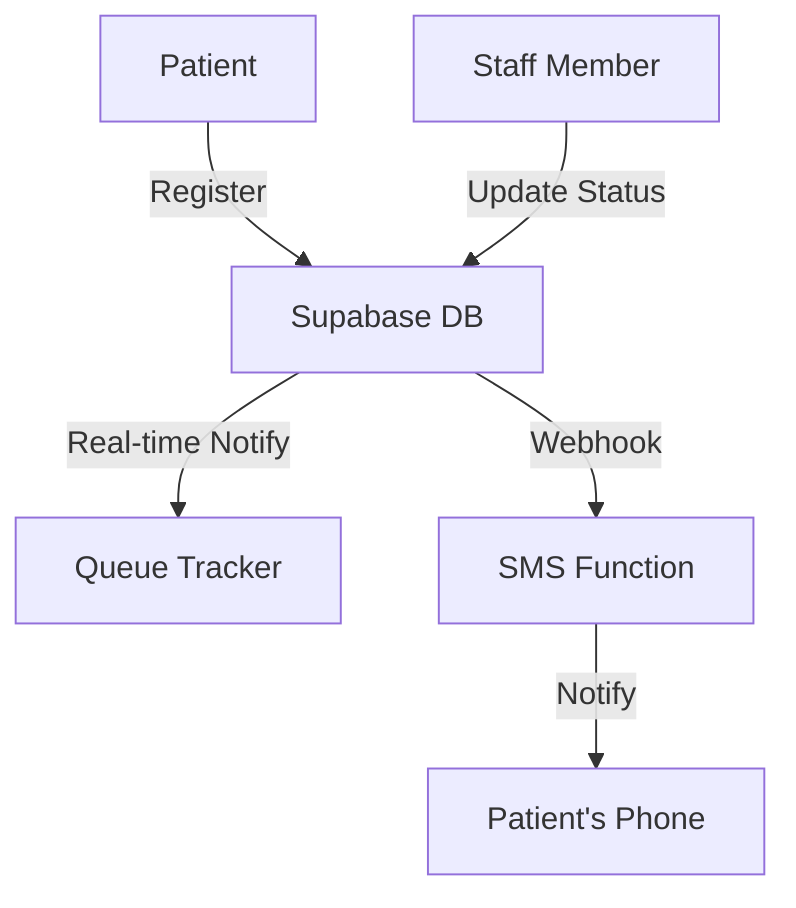

# System Architecture

## Overview
The Hospital Queue System (Hosq) is a real-time patient management application built with React, Vite, and Supabase. It allows patients to register and track their position in a queue, while providing staff with an administrative dashboard to manage the flow.

## Technology Stack
- **Frontend**: React 18, Vite, TypeScript
- **Styling**: Tailwind CSS
- **Backend/Database**: Supabase (PostgreSQL + Auth + Real-time)
- **Icons**: Lucide React

## Data Flow

## Core Components
- **PatientPortal**: Handles patient check-in.
- **QueueTracker**: Provides real-time updates to patients using Supabase Real-time.
- **EmployeeDashboard**: Allows staff to call patients and update their stage.
- **AdminDashboard**: Management of staff roles, queue stages, and emergency flags.

## Database Schema
The system relies on several key tables:
- `patients`: Stores personal details and visit reasons.
- `queue_entries`: Tracks the current status and position of patients.
- `queue_stages`: Defines the flow (e.g., Reception, Doctor, Billing).
- `user_roles`: Manages staff access levels (Admin, Doctor, etc.).

---
*Author: Peter Thairu Muigai*
*Version: 1.0.0*
